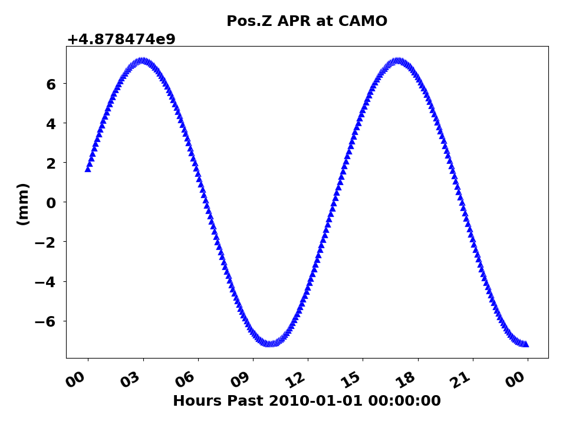
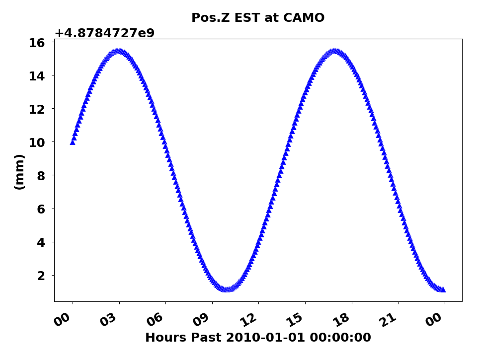
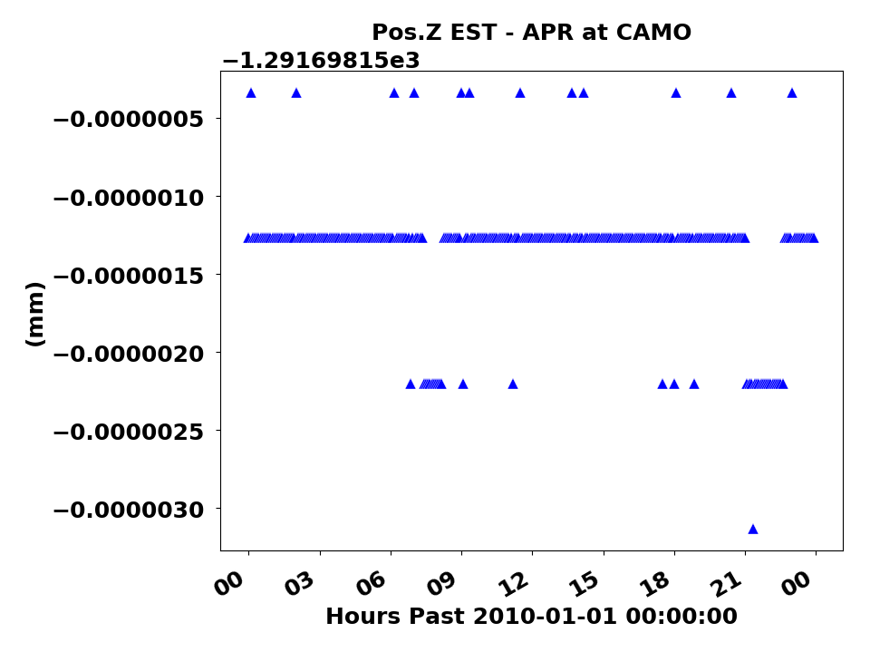
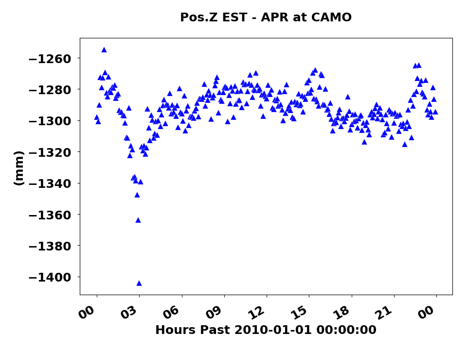
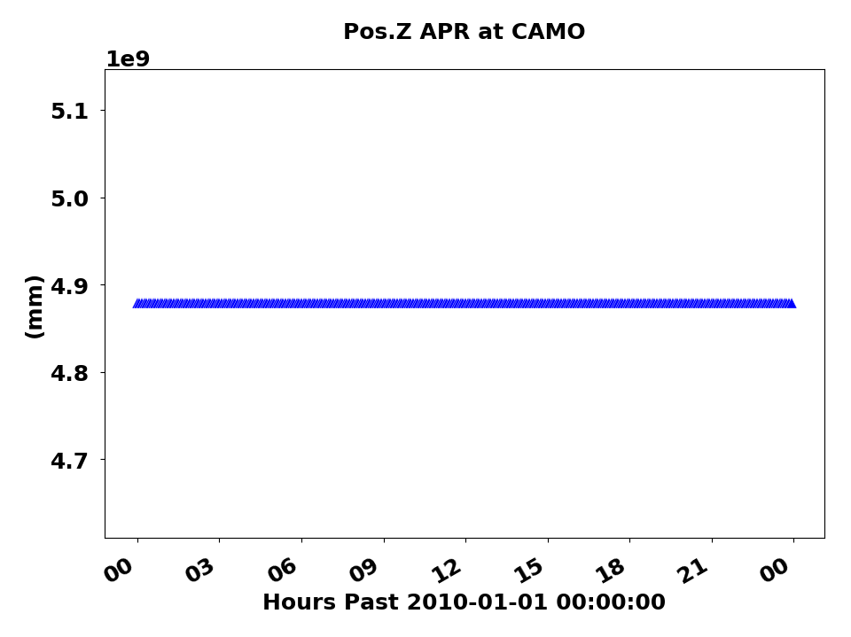
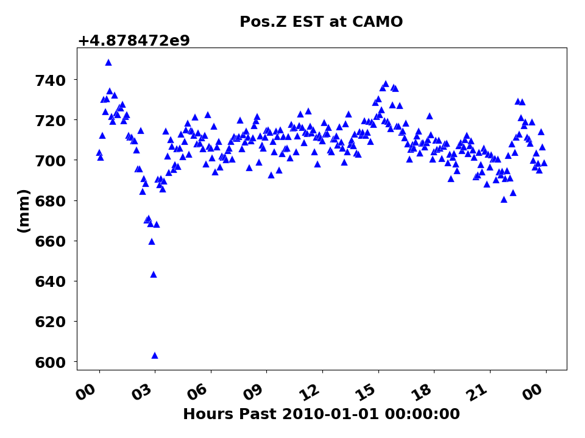
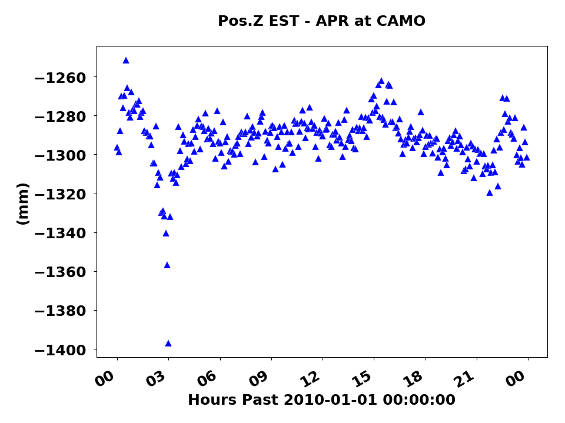
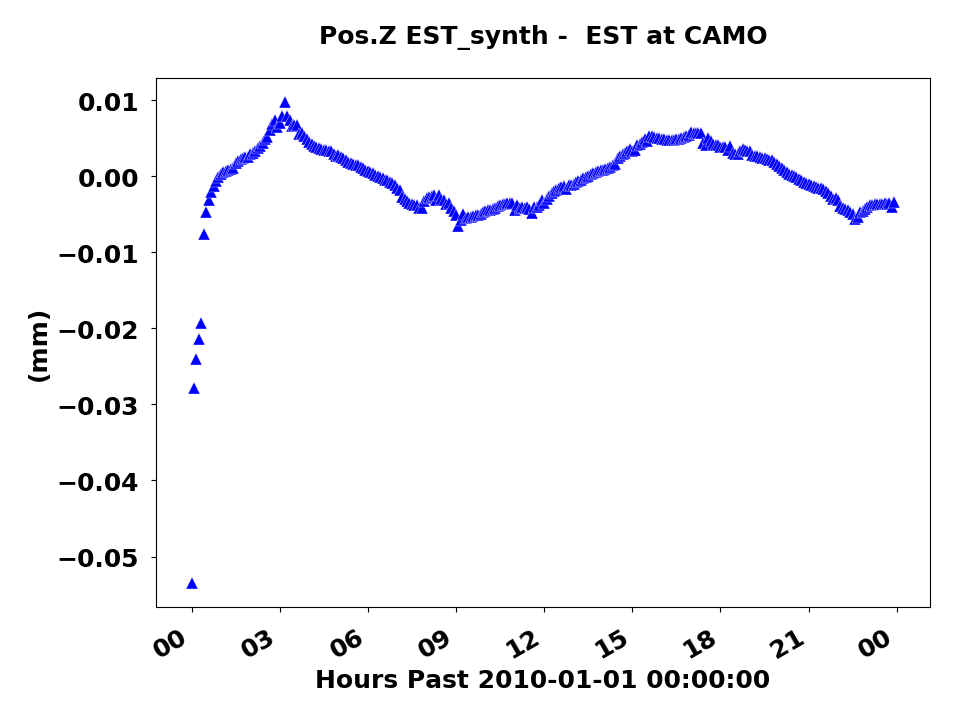

# synth-err-camo
A set of test examples for GipsyX to illustrate synth_err issue (Matviichuk et al., 2022)

The solutions can be replicated using the run scripts in each directory. Directories have suffixes in their names which correspond to the coordinate process noise values in mm and also a “synth” suffix if a priori values contain synthetic signals. 

The plots provided demonstrate estimated values (EST), a priori values (APR) and the difference between them. Two different process noise values were used in the tests: 1e-6$\frac{mm}{\sqrt{s}}$ and 3.2$\frac{mm}{\sqrt{s}}$, or a coordinate process noise close to 0 and a standard coordinate process noise used throughout the manuscript. 

Please note that GipsyX uses meters, and though the directories are have process noise suffixes in $mm$, 1e-6 $\frac{mm}{\sqrt{s}}$ and 3.2 $\frac{mm}{\sqrt{s}}$, the actual values in the tree config files are 1e-9 $\frac{m}{\sqrt{s}}$ and 3.2e-3 $\frac{m}{\sqrt{s}}$, respectively. The plots were made only for Z coordinate component using Linux standard utilities and utilities provided with GipsyX (plots for other components can be made similarly):

```bash
cd camo2010.001_3.2
```
```bash
grep Station.CAMO.State.Pos.Z smoothFinal.tdp | cm 1 "c2*1000" | matp -nk -xl "Hours Past 2010-01-01 00:00:00" -secPast -fmtX "%H" -yl "(mm)" -t "Pos.Z APR at CAMO" -png APR_Z.png
```

```bash
grep Station.CAMO.State.Pos.Z smoothFinal.tdp | cm 1 "c3*1000" | matp -nk -xl "Hours Past 2010-01-01 00:00:00" -secPast -fmtX "%H" -yl "(mm)" -t "Pos.Z EST at CAMO" -png EST_Z.png
```

```bash
grep Station.CAMO.State.Pos.Z smoothFinal.tdp | cm 1 "(c3 - c2)*1000" | matp -nk -xl "Hours Past 2010-01-01 00:00:00" -secPast -fmtX "%H" -yl "(mm)" -t "Pos.Z EST - APR at CAMO" -png diff_EST_APR_Z.png
```

The reason for the inversion of synth_err graphs from Penna et al (2015) and Matviichuk et al (2022) lies in the specifics of the utility that does the conversion from ECEF (XYZ) to the local East, North, Up (ENU). The utility reads the array of a priori coordinates and the array of the estimated coordinates, computing the difference between the respective a priori and estimate values at each time interval. With 0 process noise approaching 0 (1e-6$\frac{mm}{\sqrt{s}}$ in the example provided), the estimated coordinates are effectively the same as a priori (with some rounding noise) as the filter is not allowed to move (variances will obviously explode in this case).

In case of 6 mm harmonic signal being present in the a priori values, the same signal will be present in the estimate (the timeseries are exactly the same) which makes the difference between the two arrays, a prioris and estimates, equal to 0 at all epochs (that’s what `tdp2envDiff.py` in GipsyX does). Further harmonic analysis of this 0-valued timeseries (the ENU is computed based on deltas between a prioris and estimates) will produce 0 mm amplitudes at all frequencies, including the synthetic 13.96 hour period. The visual representation of the phenomenon is demonstrated in Fig. 1.

<!-- Fig 1 -->
|  |  |  |
 ------------- | ------------- | ------------- 
||

**Figure 1.** *CAMO Z component coordinates. Left to right: a priori, estimated, difference between the estimated and a priori. 6 mm synth signal was added, 1e-6*$\frac{mm}{\sqrt{s}}$ *and 0.1*$\frac{mm}{\sqrt{s}}$ *process noise values were used for coordinates and troposphere. The synthetic  signal gets completely eliminated by differencing.*

The situation in GIPSY6 may be different depending on the specific line that was extracted from the output of the supplied utility, `tdp2llh`. Extracting the third line from GIPSY6’s `tdp2llh` output would perfectly replicate the described phenomenon and thus we may speculate that this was the very reason of the issue. Below is the part of the help message that is of most interest:

```
...
The output consist of three white-space delimited lines per epoch:

    Epoch, Lat(deg), Long(deg), height(m), sigma3d(m), staid
    Epoch, North(m), East(m), Vertical(m), sigma3d(m), staid, 'nev'
    Epoch, North(m), East(m), Vertical(m), sigma3d(m), staid, 'est'

The values in the second line are relative to the first point in the TDP
file, while the values in the the third line are relative to the nominal
position for that epoch.
...
```
<!-- Fig 2 -->
|  |  |  |
 ------------- | ------------- | ------------- 
||

**Figure 2.** *CAMO Z component coordinates. Left to right: a priori, estimated, difference between the estimated and a priori. 6 mm synth signal was added, 3.2*$\frac{mm}{\sqrt{s}}$ *and 0.1*$\frac{mm}{\sqrt{s}}$ *process noise values were used for coordinates and troposphere.*

The 0 mm synth_err at $>=$ 1$\frac{mm}{\sqrt{s}}$ coordinate process noise in the Penna et al (2015) can be explained similarly – at this process noise, the synthetic a prioris do not impact the solution in any way (see Fig. 2). The almost complete absence of synthetic signal can be proved by differencing this solution with the solution that had no synthetic signal in the a prioris, Fig. 3. The resulting timeseries demonstrates residual synthetic signal with magnitude of $\sim$ 0.01 mm, which is absolutely negligible. The code to generate this difference plot is as follows:

```bash
paste camo2010.001_3.2/smoothFinal.tdp camo2010.001_synth_3.2/smoothFinal.tdp | grep Station.CAMO.State.Pos.Z | cm 1 "(c8-c3)*1000"| matp -nk -xl "Hours Past 2010-01-01 00:00:00" -secPast -fmtX "%H" -yl "(mm)" -t "Pos.Z EST_synth -  EST at CAMO" -png cmp_Z.png
```

<!-- Fig 3 -->
|  |  |  |
 ------------- | ------------- | ------------- 
||

**Figure 3.** *CAMO Z component coordinates. Left to right: a priori, estimated, difference between the estimated and a priori. No synth signal was added, 3.2*$\frac{mm}{\sqrt{s}}$ *and 0.1*$\frac{mm}{\sqrt{s}}$ *process noise values were used for coordinates and troposphere.*

If the estimated coordinate timeseries has no 6 mm signal left at 13.96 hour period, then differencing it with a priori timeseries will automatically introduce this signal into the ENU, hence 0 mm error. The problem is that this signal was never in the original ECEF (XYZ) estimates.

<!-- Fig 4 -->
|  |
 ------------- |
|

**Figure 4.** *CAMO Z component coordinates difference between estimated coordinates of solution with 6 mm synthetic signal added (Fig. 3) and solution with no synthetic signal (Fig. 1). Both used 3.2*$\frac{mm}{\sqrt{s}}$ *and 0.1*$\frac{mm}{\sqrt{s}}$ *process noise values for coordinates and troposphere. As seen, the residual synthetic signal is ~0.01 mm in magnitude.*

The basic logic behind the tests in Matviichuk et al (2020) and Matviichuk et al (2021) is that the signal should not be present in ENU if it’s absent in the XYZ. Thus, a single constant a priori value is used in the differencing procedure even if a prioris contain synthetic harmonic signal. In this case, the 1e-6$\frac{mm}{\sqrt{s}}$ process noise will produce 0 mm error in the 6 mm synthetic signal test as the a priori and estimate values are exactly the same. The approach is effectively an equivalent of the extraction of every second line of each epoch from the GIPXY6’s `tdp2llh` output – “The values in the second line are relative to the first point in the TDP file.”